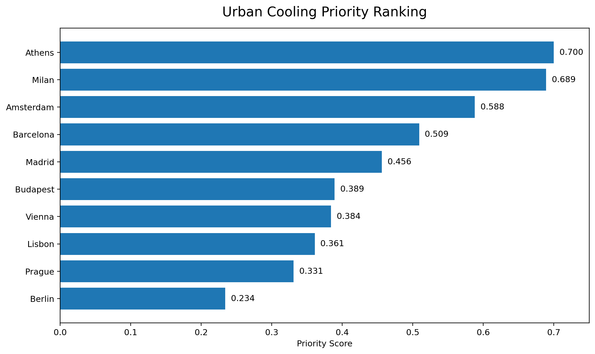

# Smart Cities, Cooler Futures

## Week 3 Check-in
### A Data-Driven Framework for Urban Cooling Prioritisation

---

## 1. The Urban Heat Challenge

Urban heat does not affect all cities in the same way.

A city may experience high temperatures, but cooling priority also depends on population exposure, urban form and the availability of green infrastructure.

The project therefore asks:

> **Where should cities act first to reduce urban heat vulnerability, and what type of cooling intervention should they prioritise?**

The analysis compares **10 European cities**.

---

## 2. What Did We Analyse?

To compare the cities, I analysed six indicators across four main dimensions:

| Dimension | Indicator |
|---|---|
| **Heat** | UHI Intensity |
| **Exposure** | Population Density |
| **Urban Form** | Building Density + Building Height |
| **Cooling Capacity** | Green Space + Street Trees |

These dimensions represent different parts of urban heat vulnerability.

> **Urban cooling priority is not determined by temperature alone. It depends on the combination of Heat + Exposure + Urban Form + Cooling Capacity.**

---

## 3. How Did the Analysis Develop?

The analysis was developed step by step.

### Step 1 — Measure Urban Heat Vulnerability

The six indicators were analysed for all 10 cities.

**Heat + Exposure + Urban Form + Cooling Capacity**

↓

### Step 2 — Calculate the Priority Score

Because the indicators use different units, they were normalised to a common **0–1 risk scale**.

They were then combined using equal weights to create one comparable **Urban Cooling Priority Score** for each city.

**6 Indicators → Normalisation → Priority Score → Ranking**

↓

### Step 3 — Explain the Ranking

The ranking tells us **where** cooling action should be prioritised, but not **why**.

Therefore, Driver Analysis was used to identify the main factors behind each city's priority.

↓

### Step 4 — Strengthen the Analysis

The Priority Score and ranking alone were not enough to support urban cooling decisions.

Additional analytical layers were therefore added:

- **LST 2021–2024** → to analyse recent summer surface heat
- **Sensitivity Analysis** → to test whether the ranking remains stable under different weighting scenarios
- **Impervious-Surface Change 2021–2024** → to provide recent urban-development context
- **Intervention Gap Analysis** → to identify Green-Space and Street-Tree gaps

↓

### Step 5 — From Evidence to Action

The different analytical results were brought together to support city-specific cooling recommendations.

**Priority + Drivers + Additional Analysis → Cooling Recommendation**

---

### Analysis Workflow

**6 Urban Indicators**  
↓  
**Priority Score**  
↓  
**City Ranking**  
↓  
**Drivers + LST + Sensitivity + Intervention Gaps**  
↓  
**City-Specific Cooling Recommendations**

---

## 4. What Did the Priority Score Show?

The final ranking identified:

1. **Athens — 0.700**
2. **Milan — 0.689**
3. **Amsterdam — 0.588**

### Priority Ranking

The important result is that these cities do not rank highly for the same reason.

Athens and Milan emerge as the highest cooling priorities, followed by Amsterdam.

For example:

- **Athens** → UHI Intensity + Population Density
- **Milan** → Green-Space Deficit + UHI Intensity
- **Amsterdam** → Building Density + Green-Space Deficit

> **Different cities can have high cooling priority for different reasons.**

---

## 5. What Did the Additional Analysis Show?

The additional Week 3 analysis helped test and explain the Priority Score.

### Summer Heat

Satellite Land Surface Temperature data were analysed for summer **2021–2024**.

- **Madrid** has the highest four-year mean summer LST: **43.03°C**
- **Athens** follows with **40.47°C**
- **9 of 10 cities** recorded higher summer LST in 2024 than in 2021

An important finding was:

> **Madrid is the hottest city based on mean LST, but it ranks fifth in the overall Priority Score.**

This confirms that temperature alone does not determine overall cooling priority.

### Robustness

Different weighting scenarios were tested to check whether the Priority Ranking changes.

**Athens and Milan remain first or second across all scenarios.**

Budapest is more sensitive and moves between **rank 3 and rank 7**.

This means that the highest priorities are relatively stable, while some mid-ranked cities depend more on the planning perspective.

### Recent Urban Change

Impervious-surface change from **2021–2024** was also analysed.

The relationship between impervious-surface increase and LST change was very weak:

**r = -0.139**

Therefore, recent impervious change is used as supporting context rather than as part of the Priority Score.

---

## 6. From Analysis to Action

The final analytical step was to identify **Green-Space and Street-Tree Intervention Gaps**.

This helps connect the analytical evidence with practical cooling actions.

| City | Main Evidence | Recommended Action |
|---|---|---|
| **Athens** | Heat + Population Exposure | Targeted cooling & shade |
| **Milan** | Heat + Green-Space Gap | Expand green infrastructure |
| **Amsterdam** | Building Density + Green-Space Gap | Expand green infrastructure |
| **Madrid** | Street-Tree Gap + Heat | Expand street-tree coverage |
| **Vienna** | Green + Tree Gaps | Expand green infrastructure & trees |
| **Budapest** | Green-Space Gap + Heat | Green infrastructure & targeted cooling |

The analysis therefore moves from:

**Which city should act first?**

to:

**Why is the city a priority, and what type of cooling action is appropriate?**

---

## 7. Week 3 Outcome

The framework can now answer:

**WHERE?** → Priority Score

**WHY?** → Driver Analysis

**IS HEAT CHANGING?** → LST 2021–2024

**HOW ROBUST?** → Sensitivity Analysis

**WHAT CHANGED?** → Impervious-Surface Change

**WHAT SHOULD CITIES DO?** → Intervention Gap + Recommendation

The final analytical results were also transferred to **PostgreSQL** and validated using SQL queries.

---

## 8. Key Conclusion

> **Urban cooling priority is not simply a question of which city is hottest.**

The analysis shows that cooling priority depends on the combination of:

**Heat + Exposure + Urban Form + Cooling Capacity**

Athens and Milan remain robust high-priority cities, but the reasons behind vulnerability differ between cities.

Therefore, the results support a **city-specific approach to urban cooling rather than one solution for all cities.**

---

## 9. Next Steps

- **GitHub** — organise and document the final project workflow
- **Tableau** — build the final decision-support visualisation
- **Streamlit** — develop the interactive application
- **Final Presentation** — communicate and practise the final analytical story